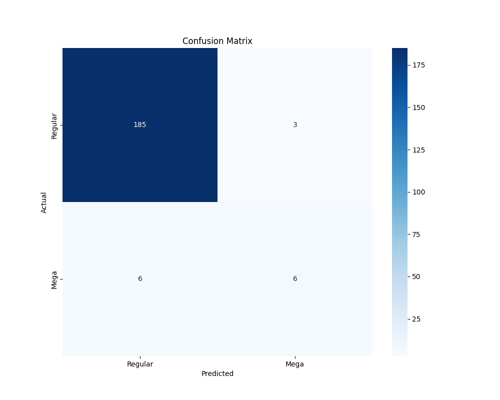
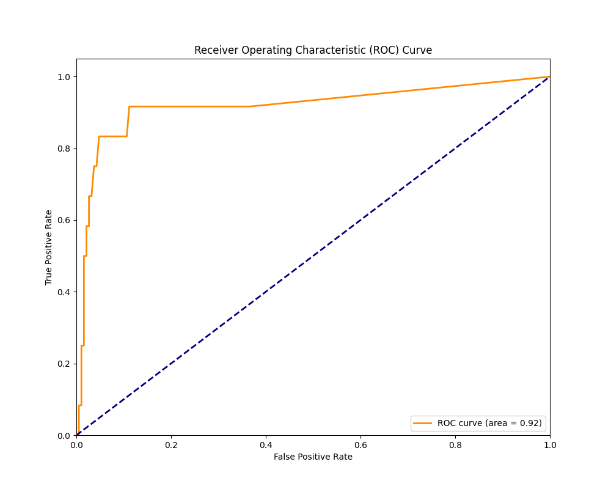
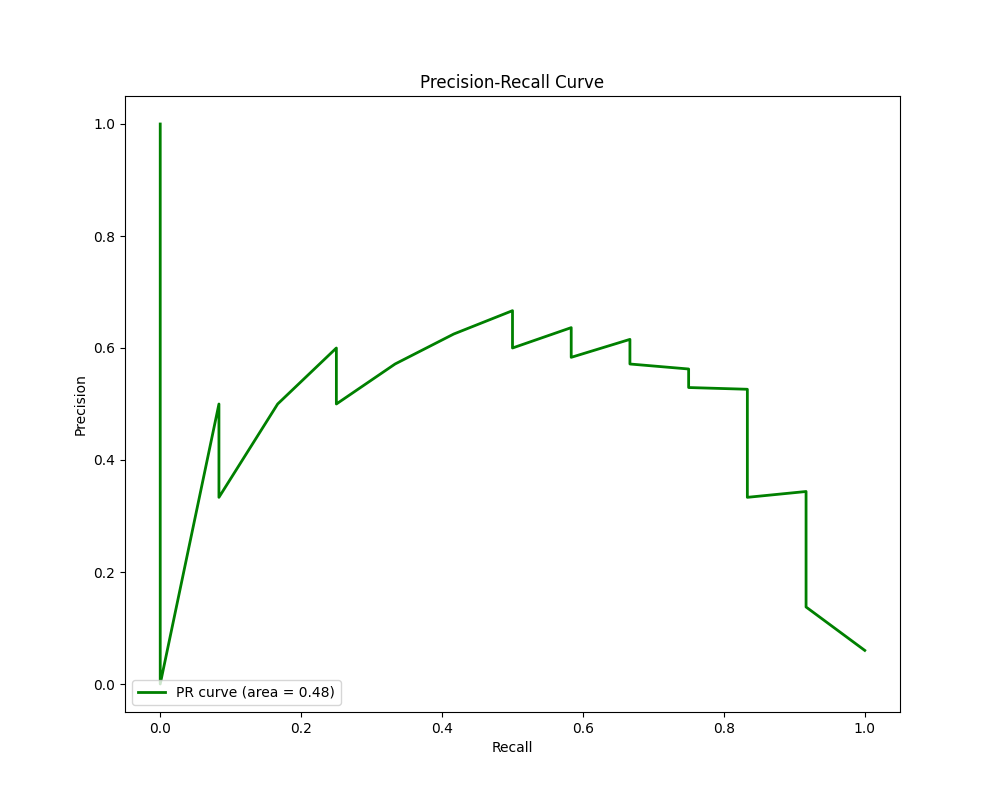
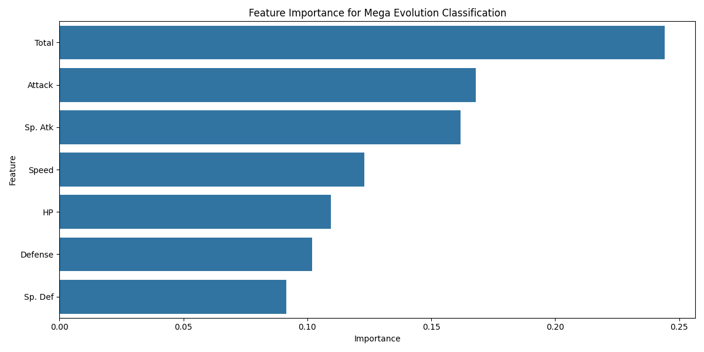

# Pokemon Mega Evolution Predicter

## Project Overview
This classifier used random forest algorith to analyze Pokemon data and identifies patterns to distinguish Pokemon with Mega Evolutions from regular Pokemon. This can be useful for understanding the characteristics that make a Pokemon eligible for mega evolution and predicting which Pokemon might recieve mega evolution in future games 

## Requirements
- Python 3.6+
- pandas
- numpy
- matplotlib
- seaborn
- scikit-learn
- Pokemon dataset

## Installations 

To run this project, you need to install the following packages:

```python
pip install numpy
pip install pandas
pip install matplotlib
pip install seaborn
pip install scikit-learn
```

## Dataset
The classifier requires a Pokemon dataset in CSV format. The dataset includes various statistical information such as base stats, generation and legendary status along with the name of the Pokemon. 

Pokemon data: 

[Dataset](Pokemon.csv)


CVS file has following columns:
- Name
- HP
- Attack
- Defense
- Special Attack
- Special Defense
- Speed
- Total
- Type 1
- Type 2
- Generation
- Legendary

## Output files
### Confusion matrix


### ROC Curve


### Precision-recall Curve 


### Feature Importance


### Mega Evolution Predictions
[Mega Evolution Predictions](mega_evolution_predictions.csv)

## Output 

### Sample Output(from terminal)

```python
Dataset shape: (800, 13)

First few rows:
   #                   Name Type 1  Type 2  ...  Sp. Def  Speed  Generation  Legendary
0  1              Bulbasaur  Grass  Poison  ...       65     45           1      False
1  2                Ivysaur  Grass  Poison  ...       80     60           1      False
2  3               Venusaur  Grass  Poison  ...      100     80           1      False
3  3  VenusaurMega Venusaur  Grass  Poison  ...      120     80           1      False
4  4             Charmander   Fire     NaN  ...       50     65           1      False

[5 rows x 13 columns]
```

### Classification report

```python

              precision    recall  f1-score   support

           0       0.97      0.98      0.98       188
           1       0.67      0.50      0.57        12

    accuracy                           0.95       200
   macro avg       0.82      0.74      0.77       200
weighted avg       0.95      0.95      0.95       200
```

### Sample Predictions

```python
Pokemon Mega_Evolution
0                  Bulbasaur             No
1                    Ivysaur             No
2                   Venusaur             No
3      VenusaurMega Venusaur             No
4                 Charmander             No
5                 Charmeleon             No
6                  Charizard             No
7  CharizardMega Charizard X            Yes
8  CharizardMega Charizard Y            Yes
9                   Squirtle             No

```
- Model Recall for Mega Evolution: 88%
- Model Precision for mega evolution: 94%

